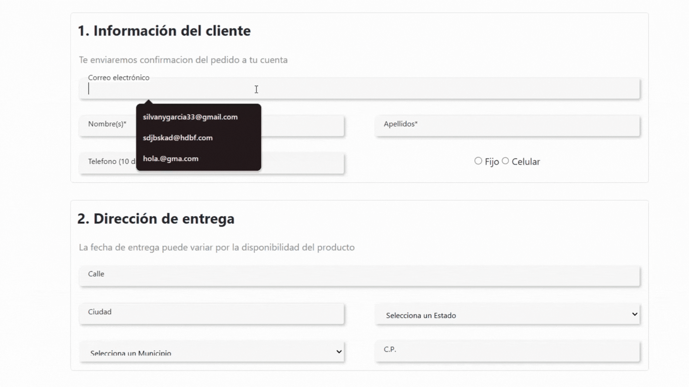

# Formulario de Validación en JavaScript
 Este proyecto muestra un formulario web con validación personalizada usando expresiones regulares en JavaScript. Además, carga dinámicamente los estados y municipios de México usando la API de Copomex.

 ## Vista previa 📽️
 

 ## Características

- Validación de campos como:
  - Nombre y apellidos
  - Correo electrónico
  - Teléfono
  - Calle y ciudad
  - Código postal
- Carga dinámica de:
  - Estados de México
  - Municipios (según el estado seleccionado)
- Retroalimentación visual de errores o datos correctos

## Tecnologias utilizadas
1. HTML
2. CSS
3. JAVASCRIPT(vanilla JS)
4. API COPOMEX
